# [css][js] 思源笔记使用体验增强方案分享

---

- [css][js] 思源笔记使用体验增强方案分享 - 链滴
- [https://ld246.com/article/1753676005261](https://ld246.com/article/1753676005261)
- 使用了比较久的思源笔记，特分享自己用到现在依旧保留的功能，供尚不熟悉思源笔记的朋友使用。 1 默认 midnight 主题 CSS 调整代码 修改原则是保持默认主题的基调并做适量简化，主要有： 降低默认主题配色的对比度（light 主题没有调整，习惯明亮主题的朋友直接跳过该段）。 微调基础样式，包括标题、特殊块（代码、
- 2025-08-05 20:26

---

使用了比较久的思源笔记，特分享自己用到现在依旧保留的功能，供尚不熟悉思源笔记的朋友使用。

## 1 默认 midnight 主题 CSS 调整代码

修改原则是保持默认主题的基调并做适量简化，主要有：

- 降低默认主题配色的对比度（light主题没有调整，习惯明亮主题的朋友直接跳过该段）。
- 微调基础样式，包括标题、特殊块（代码、引用、嵌入），使他们更加统一。
- 简化了部分 ui，如面包屑和悬浮框的顶栏，可以通过鼠标悬浮重新显示，不影响功能。
- 修复了一些不太协调的点，比如边框、窗口阴影等，详见代码页。

### 1.1 预览图

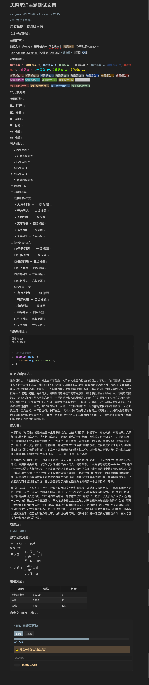

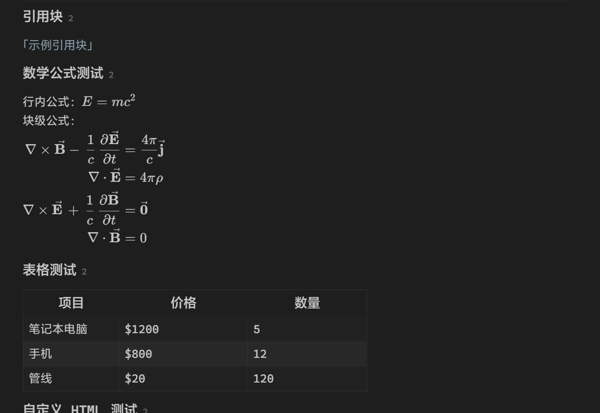

### 1.2 代码

```css
:root {
  /* ================= 颜色主题 ================= */
  /* 主色调 */
  --b3-theme-primary: hsl(201, 17%, 60%);
  --b3-theme-primary-light: hsla(201, 17%, 60%, 0.72);
  --b3-theme-primary-lighter: hsla(201, 17%, 60%, 0.48);
  --b3-theme-primary-lightest: hsla(199, 18%, 59%, 0.24);
  --b3-theme-secondary: hsl(220, 47%, 30%);

  /* 背景色 */
  --b3-theme-background: hsl(0, 0%, 12%);
  --b3-theme-editor-background: hsl(0, 0%, 10%);
  --b3-theme-background-light: hsl(0, 0%, 16%);
  --b3-theme-background-lighter: hsl(0, 0%, 28%);

  /* 表面色（侧边栏/工具栏等） */
  --b3-theme-surface: hsl(0, 0%, 13%);
  --b3-toolbar-background: var(--b3-theme-surface);
  --b3-toolbar-blur-background: var(--b3-theme-surface);
  --b3-menu-background: var(--b3-theme-surface);

  /* 文字色 */
  --b3-theme-on-background: hsl(0, 0%, 78%);
  --b3-theme-on-surface: hsl(0, 0%, 75%);

  /* 边框色 */
  --b3-border-color: hsl(0, 0%, 16%);
  --b3-border-color-light: hsl(0, 0%, 21%);
  --b3-border-color-lighter: hsl(0, 0%, 30%);
  --b3-theme-in-field-border: hsl(0, 0%, 20%);

  /* 交互状态色 */
  --b3-list-hover: hsla(0, 0%, 55%, 0.12);
  --b3-switch-checked-background: var(--b3-theme-primary-light);

  /* ================= 排版相关 ================= */
  /* 标题字号 */
  --b3-h1-size: 1.25em;
  --b3-h2-size: 1.15em;
  --b3-h3-size: 1.1em;
  --b3-h4-size: 1.05em;
  --b3-h5-size: 1em;
  --b3-h6-size: 1em;

  /* 标题字重 */
  --b3-h1-weight: 600;
  --b3-h2-weight: 600;
  --b3-h3-weight: 500;
  --b3-h4-weight: 500;
  --b3-h5-weight: 500;
  --b3-h6-weight: 400;

  /* 圆角 */
  --b3-border-radius: 6px;
  --b3-border-radius-b: 15px;

  /* ================= 特殊元素样式 ================= */
  /* 代码块 */
  --b3-protyle-code-background: hsl(0, 0%, 10%);

  /* 链接 */
  --b3-protyle-inline-link-color: hsl(201, 17%, 60%);

  /* 引用块 */
  --b3-protyle-inline-blockref-color: hsl(201, 17%, 60%);
  --b3-protyle-inline-blockref-color-hover: hsl(201, 17%, 68%);

  /* 标记 */
  --b3-protyle-inline-mark-background: hsla(33, 100%, 66%, 0.3);
  --b3-protyle-inline-mark-color: var(--b3-theme-on-background);
  --b3-protyle-inline-tag-color: var(--b3-theme-on-surface);

  /* ================= 视觉效果 ================= */
  /* 阴影 */
  --b3-dialog-shadow: 0 8px 24px hsla(0, 0%, 0%, 0.5),
    0 4px 12px hsla(0, 0%, 0%, 0.75);
  --b3-button-shadow: 0 1px 2px hsla(0, 0%, 0%, 0.1);

  /* ================= 字体设置 ================= */
  --b3-font-family: "Cascadia Code", "Microsoft Yahei", "Helvetica Neue",
    "Luxi Sans", "DejaVu Sans", "Hiragino Sans GB", "sans-serif",
    "Apple Color Emoji", "Segoe UI Emoji", "Noto Color Emoji", "Segoe UI Symbol",
    "Android Emoji", "EmojiSymbols", system-ui;
  --b3-font-family-protyle: "Cascadia Code", "Microsoft Yahei", sans-serif;
  --b3-font-family-code: "Cascadia Code", "Microsoft Yahei UI", "mononoki",
    "Consolas", "Liberation Mono", "Menlo", "Courier", "monospace",
    "Apple Color Emoji", "Segoe UI Emoji", "Noto Color Emoji", "Segoe UI Symbol",
    "Android Emoji", "EmojiSymbols", monospace;
  --b3-font-family-math: "KaTeX_Math", "KaTeX_Main", math;
  --b3-font-family-emoji: "Twemoji Mozilla", "Segoe UI Emoji", "Segoe UI Symbol",
    "Segoe UI", "Apple Color Emoji", "Noto Color Emoji", "Android Emoji", emoji;
}

/* ================= 基础样式 ================= */
.fn__flex-1 {
  font-size: 15px;
} /* 侧边栏、标签页字体基本大小 */

.b3-list-item__text {
  color: var(--b3-theme-on-surface) !important;
  font-size: 1em !important;
} /* 侧边栏列表文字颜色 */

/* ================= 图片处理 ================= */
.img .protyle-action__title {
  font-size: 0.8em !important;
} /* 图片名称字体减小 */
.protyle-wysiwyg .img {
  opacity: 0.65;
  transition: opacity 0.25s linear;
} /* 降低图片的亮度 */
.protyle-wysiwyg .img:hover {
  opacity: 1;
} /* 鼠标指向图片的时候变亮 */

/* ================= 块元素样式 ================= */
/* 引用块 */
.protyle-wysiwyg
  [data-node-id]
  span[data-type~="block-ref"]:not(.av__celltext) {
  color: var(--b3-protyle-inline-blockref-color);
  opacity: 1 !important;
} /* 引用块文字颜色 */
.protyle-wysiwyg
  [data-node-id]
  span[data-type~="block-ref"]:not(.av__celltext):hover {
  color: var(--b3-protyle-inline-blockref-color-hover);
  text-decoration: underline;
} /* 引用块鼠标悬停颜色 */
.protyle-wysiwyg [data-node-id] span[data-type~="block-ref"]::before,
.protyle-wysiwyg
  [data-node-id]
  span[data-type~="block-ref"][data-subtype="s"]::before {
  content: "｢";
} /* 引用块前缀 */
.protyle-wysiwyg [data-node-id] span[data-type~="block-ref"]::after,
.protyle-wysiwyg
  [data-node-id]
  span[data-type~="block-ref"][data-subtype="s"]::after {
  content: "｣";
} /* 引用块后缀 */

/* 嵌入块 */
.render-node[data-type="NodeBlockQueryEmbed"] {
  background-color: var(--b3-theme-editor-background) !important;
  border: 1px solid var(--b3-border-color) !important;
  border-radius: var(--b3-border-radius) !important;
  box-shadow: var(--b3-button-shadow) !important;
} /* 嵌入块背景色、边框、圆角、阴影 */
.protyle-wysiwyg
  [data-node-id].render-node[data-type="NodeBlockQueryEmbed"]
  > .protyle-wysiwyg__embed {
  -webkit-user-modify: read-only;
  border-top: 2px dashed transparent;
  border-image: repeating-linear-gradient(
      to right,
      var(--b3-border-color-lighter) 0,
      var(--b3-border-color-lighter) 4px,
      transparent 4px,
      transparent 8px
    )
    1;
  position: relative;
} /* 嵌入块内容样式 */
.render-node[data-type="NodeBlockQueryEmbed"]::before {
  content: "";
  background-color: var(--b3-border-color-lighter);
  width: 2px;
  border-radius: var(--b3-border-radius);
  position: absolute;
  left: 2px;
  top: 6px;
  bottom: 6px;
} /* 嵌入块左侧竖线 */

/* 代码块 */
.code-block {
  color: var(--b3-theme-on-surface) !important;
  background: var(--b3-theme-editor-background) !important;
  margin-bottom: 2px !important;
  border-radius: var(--b3-border-radius) !important;
  box-shadow: var(--b3-button-shadow) !important;
} /* 代码块背景色、边框、圆角、阴影 */
div:not(#preview) > .protyle-wysiwyg .code-block .hljs {
  max-height: 300px !important;
} /* 代码块最大高度 */
.protyle-icon {
  color: #ffffff !important;
  background: hsl(0, 0%, 2%) !important;
} /* 代码块图标颜色、背景色 */

/* 引述块 */
.protyle-wysiwyg .bq:before {
  background-color: var(--b3-theme-background-lighter) !important;
} /* 引用块背景色 */
.protyle-wysiwyg .bq {
  color: var(--b3-theme-on-surface) !important;
  background-color: var(--b3-theme-editor-background) !important;
  font-size: 0.9em;
  box-shadow: var(--b3-button-shadow) !important;
} /* 引用块文字颜色、背景色、字号、阴影 */

/* ================= 行内元素样式 ================= */
/* 行内代码 */
.protyle-wysiwyg span[data-type~="code"] {
  border-radius: var(--b3-border-radius);
  background-color: var(--b3-protyle-code-background);
  border: 1px solid var(--b3-border-color-light);
} /* 行内代码背景色、边框、圆角 */

/* 链接 */
.protyle-wysiwyg [data-node-id] span[data-type~="a"]:hover {
  color: var(--b3-protyle-inline-blockref-color-hover) !important;
} /* 链接鼠标悬停颜色 */
.protyle-wysiwyg [data-node-id] span[data-type~="a"]::before {
  content: "<";
} /* 链接前缀 */
.protyle-wysiwyg [data-node-id] span[data-type~="a"]::after {
  content: ">";
} /* 链接后缀 */

/* 标签 */
.protyle-wysiwyg [data-node-id] span[data-type~="tag"]::before {
  content: "#" !important;
} /* 标签前缀 */
.protyle-wysiwyg [data-node-id] span[data-type~="tag"] {
  border: unset !important;
  color: var(--b3-protyle-inline-tag-color);
  background-color: var(--b3-border-color-light) !important;
} /* 标签背景色、边框 */

/* 快捷键 */
.protyle-wysiwyg span[data-type~="kbd"] {
  font: var(--b3-font-family-code);
  color: var(--b3-theme-on-background);
  background-color: var(--b3-theme-surface);
  border: var(--b3-border-color-light) solid 1px !important;
  border-radius: var(--b3-border-radius);
} /* 快捷键背景色、边框、圆角 */

/* 下划线 */
.protyle-wysiwyg span[data-type~="u"] {
  border-bottom: unset;
  text-decoration-line: underline;
  text-decoration-style: wavy;
  text-decoration-color: #bc1c1c;
  text-decoration-thickness: 2px;
  text-decoration-skip-ink: none;
} /* 下划线样式 */

/* ================= 表格样式 ================= */
table {
  background-color: var(--b3-theme-surface) !important;
  border: 1px solid var(--b3-border-color) !important;
  font-size: var(--b3-h6-size) !important;
  font-weight: var(--b3-h6-weight) !important;
} /* 表格背景色、边框、字号、字重 */
thead {
  background-color: var(--b3-theme-editor-background) !important;
  font-size: var(--b3-h3-size) !important;
  font-weight: var(--b3-h3-weight) !important;
} /* 表头背景色、字号、字重 */

/* ================= 表单元素 ================= */
/* 输入框 */
.b3-text-field {
  box-shadow: var(--b3-button-shadow) !important;
  border: 1px solid var(--b3-border-color-light) !important;
  background-color: var(--b3-theme-editor-background) !important;
} /* 输入框背景色、边框、阴影 */
.b3-text-field:not(.b3-text-field--text):focus {
  border: 1px solid var(--b3-theme-background-lighter) !important;
} /* 输入框聚焦时边框颜色 */
textarea {
  min-height: auto;
} /* 文本区域最小高度 */
.b3-dialog__container textarea {
  min-height: 288px;
} /* 对话框文本区域最小高度 */

/* 下拉菜单 */
.b3-select {
  box-shadow: var(--b3-button-shadow) !important;
  background-color: var(--b3-theme-background-light) !important;
  color: var(--b3-theme-on-surface) !important;
} /* 下拉菜单背景色、阴影、文字颜色 */
.b3-select:focus {
  background-color: var(--b3-theme-surface-lighter) !important;
} /* 下拉菜单聚焦时背景色 */
.b3-select:hover {
  box-shadow: var(--b3-button-shadow) !important;
  background-color: var(--b3-theme-surface-lighter) !important;
} /* 下拉菜单悬停时背景色 */

/* 按钮 */
.b3-button {
  box-shadow: var(--b3-button-shadow) !important;
  background-color: var(--b3-theme-background-light) !important;
  color: var(--b3-theme-on-surface) !important;
} /* 按钮背景色、阴影、文字颜色 */
.b3-button:hover {
  box-shadow: var(--b3-button-shadow) !important;
  background-color: var(--b3-theme-surface-lighter) !important;
  color: var(--b3-theme-on-background) !important;
} /* 按钮悬停时背景色、文字颜色 */
.b3-button:focus {
  background-color: var(--b3-theme-surface-lighter) !important;
} /* 按钮聚焦时背景色 */
.b3-button--outline {
  background-color: var(--b3-theme-surface) !important;
} /* 按钮轮廓样式背景色 */

/* ================= 标题样式 ================= */
.protyle-title__input {
  font-size: calc(var(--b3-h1-size) * 1.4) !important;
  font-weight: var(--b3-h1-weight) !important;
} /* 文档标题字体大小、字重 */
.h1 {
  font-size: var(--b3-h1-size) !important;
  font-weight: var(--b3-h1-weight) !important;
}
.h2 {
  font-size: var(--b3-h2-size) !important;
  font-weight: var(--b3-h2-weight) !important;
}
.h3 {
  font-size: var(--b3-h3-size) !important;
  font-weight: var(--b3-h3-weight) !important;
}
.h4 {
  font-size: var(--b3-h4-size) !important;
  font-weight: var(--b3-h4-weight) !important;
}
.h5 {
  font-size: var(--b3-h5-size) !important;
  font-weight: var(--b3-h5-weight) !important;
}
.h6 {
  font-size: var(--b3-h6-size) !important;
  font-weight: var(--b3-h6-weight) !important;
}

/* 标题级别标记 */
div[data-subtype^="h1"]:not([type]) > div:first-child:after,
div[data-subtype^="h2"] > div:first-child:after,
div[data-subtype^="h3"] > div:first-child:after,
div[data-subtype^="h4"] > div:first-child:after,
div[data-subtype^="h5"] > div:first-child:after,
div[data-subtype^="h6"] > div:first-child:after {
  font-size: 0.65em;
  opacity: 0.4;
} /* 标题级别标记字体大小、透明度 */
div[data-subtype^="h1"]:not([type]) > div:first-child:after {
  content: " 1";
}
div[data-subtype^="h2"] > div:first-child:after {
  content: " 2";
}
div[data-subtype^="h3"] > div:first-child:after {
  content: " 3";
}
div[data-subtype^="h4"] > div:first-child:after {
  content: " 4";
}
div[data-subtype^="h5"] > div:first-child:after {
  content: " 5";
}
div[data-subtype^="h6"] > div:first-child:after {
  content: " 6";
}

/* ================= 界面元素 ================= */
/* 标签页 */
.item--focus {
  background-color: var(--b3-theme-background) !important;
} /* 标签页选中时背景色 */
.layout-tab-bar .item--unupdate:not(.item--pin),
.layout-tab-bar .item--readonly {
  background-color: var(--b3-theme-surface) !important;
} /* 标签页未更新或只读时背景色 */

/* 文件树 */
.b3-list-item__icon {
  display: none;
} /* 文件树图标隐藏 */
.b3-list-item--focus {
  background-color: var(--b3-theme-background-lighter) !important;
  color: var(--b3-theme-on-background) !important;
} /* 文件树选中时背景色、文字颜色 */
.b3-list-item__text:hover {
  color: #ffffff !important;
} /* 文件树鼠标悬停时文字颜色 */

/* 面包屑 */
.protyle-breadcrumb {
  background-color: var(--b3-theme-surface);
  opacity: 0;
  height: 1px;
  min-height: 1px;
  overflow: hidden;
  transition: opacity 0.5s ease-in-out, height 0.5s ease-in-out,
    min-height 0.5s ease-in-out;
} /* 面包屑背景色、透明度、最小高度 */
.protyle-breadcrumb:hover {
  opacity: 1;
  height: auto;
  min-height: auto;
  overflow: visible;
} /* 鼠标悬停时面包屑显示 */

/* 侧边栏 */
.layout--float {
  min-height: auto;
  max-height: auto;
  min-width: 360px;
} /* 侧边栏最小高度、最大高度、最小宽度 */
.layout--float.layout__dockr,
.layout--float.layout__dockl {
  box-shadow: var(--b3-dialog-shadow);
} /* 侧边栏阴影 */
.dock__item--active {
  background-color: var(--b3-theme-background-lighter) !important;
} /* 侧边栏选中项背景色 */

/* 设置面板 */
.config__panel > .b3-tab-bar {
  color: var(--b3-theme-on-surface) !important;
  background-color: var(--b3-theme-surface) !important;
  border-right: 1px solid var(--b3-border-color) !important;
} /* 设置面板标签栏颜色、背景色、边框 */
.b3-label__text {
  color: hsl(0, 0%, 60%) !important;
} /* 设置面板标签文字颜色 */

/* ================= 功能增强 ================= */
/* 引用块悬浮面板顶栏 */
.block__popover > .block__icons {
  opacity: 0;
  height: 0;
  min-height: 0;
  overflow: hidden;
  transition: opacity 0.5s ease-in-out, height 0.5s ease-in-out,
    min-height 0.5s ease-in-out;
} /* 引用块悬浮面板图标隐藏 */
.block__popover:hover > .block__icons {
  opacity: 1;
  height: auto;
  min-height: auto;
  overflow: visible;
} /* 鼠标悬停时显示图标 */
.block__popover {
  box-shadow: var(--b3-dialog-shadow) !important;
  border-radius: var(--b3-border-radius-b) !important;
  max-height: 550px !important;
  max-width: 670px !important;
} /* 引用块悬浮面板阴影、圆角、最大高度、最大宽度 */

/* 搜索筛选按钮简化 */
.b3-chip--middle .b3-chip__close {
  opacity: 0;
  transition: opacity 0.3s ease;
} /* 搜索筛选按钮关闭图标隐藏 */
.b3-chip--middle:hover .b3-chip__close {
  opacity: 1;
} /* 鼠标悬停时显示关闭图标 */

/* ================= 问题修复 ================= */
/* 标注栏修复 */
.protyle-font > *:not(:nth-child(6), :nth-child(7)):not(:last-child) {
  display: none;
} /* 隐藏标注栏中不必要的元素 */

/* 让文档的浏览体验更加顺滑 */
/* .protyle-wysiwyg {
  scroll-behavior: smooth;
  overscroll-behavior: contain;
  overflow-y: auto;
  will-change: transform;
  backface-visibility: hidden;
  perspective: 1000px;
} */ /* 防止滚动条跳动 */

/* 滚动条修复 */
.protyle-scroll {
  position: unset;
  display: none;
} /* 隐藏块定位滚动条 */
::-webkit-scrollbar-thumb {
  cursor: default;
} /* 编辑区滚动条样式 */
::-webkit-scrollbar-thumb:hover {
  cursor: pointer;
} /* 鼠标悬停时编辑区滚动条变为手指光标 */

/* 列表块修复 */
.protyle-wysiwyg
  [data-node-id].li
  > .protyle-action
  ~ [data-type="NodeHeading"] {
  line-height: calc(var(--b3-font-size-editor) * 1.625) !important;
} /* 列表块标题行高 */
.protyle-wysiwyg [data-node-id].li > [data-node-id] {
  margin-left: 24px;
} /* 列表块子元素左边距 */

/* 集市搜索栏修复 */
.config-bazaar__title {
  backdrop-filter: unset;
  background: var(--b3-theme-background);
} /* 集市搜索栏背景色 */

/* 滑动按钮隐藏 */
.b3-slider {
  display: none !important;
} /* 隐藏滑动按钮 */

```

## 2 [链滴论坛暗黑主题](https://ld246.com/article/1753792508375)

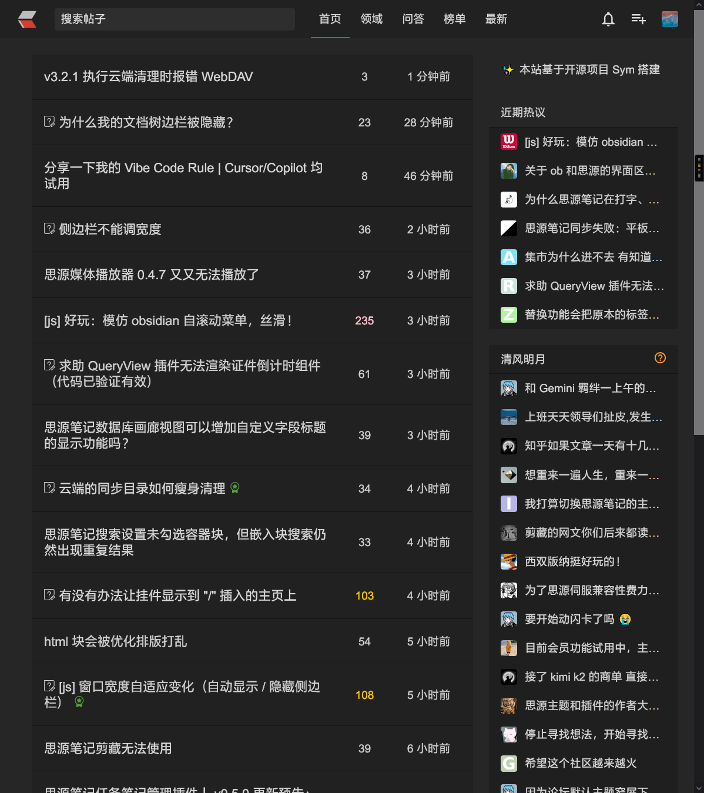

## 3 增强使用体验的 JS 代码

这部分功能为其他作者开发，故提供帖子链接。

3.1 [顺滑的自滚动菜单](https://ld246.com/article/1753713199859)

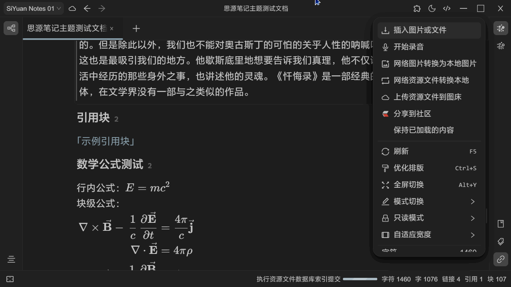

3.2 [窗口宽度自适应变化](https://ld246.com/article/1753680748175)

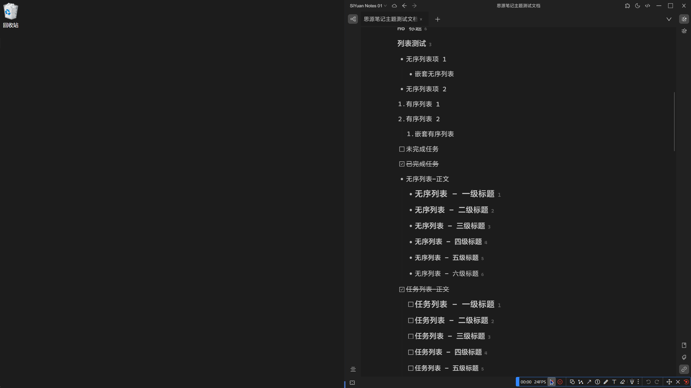

3.3 [用于快速跳转的路径地图](https://ld246.com/article/1746636401984)

思源关系图谱调整，具体请到作者帖子查看。

3.4 [alt+单击图片打开本地图片编辑器](https://ld246.com/article/1733828267086)

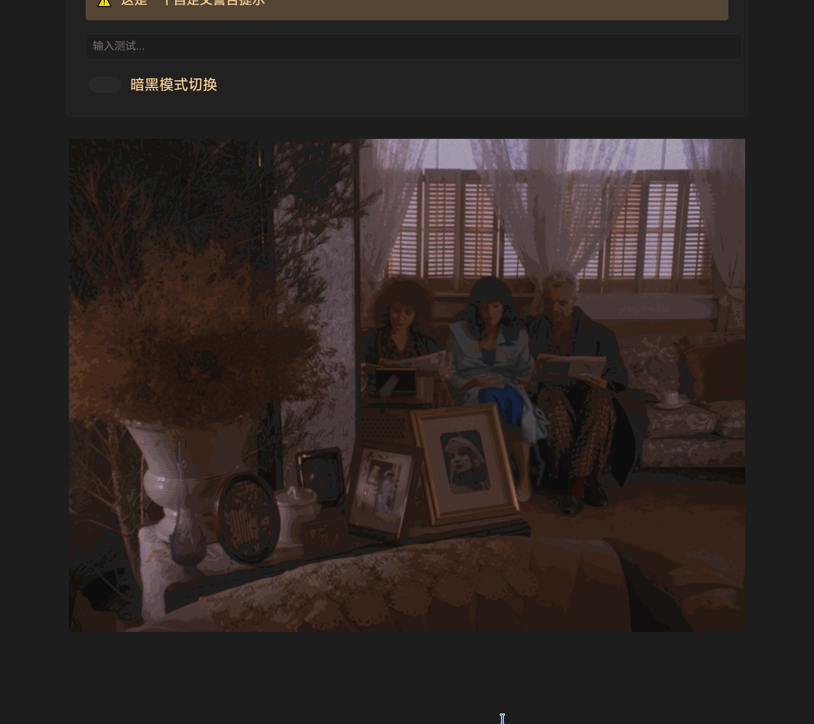

3.5 [顶栏倒计时](https://ld246.com/article/1728048965009)

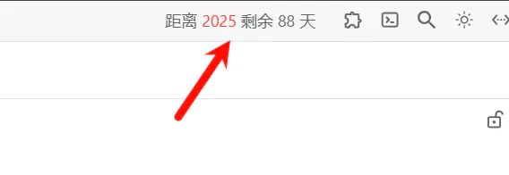

3.6 [在顶栏添加按钮，快捷打开代码片段界面](https://ld246.com/article/1711109797219)

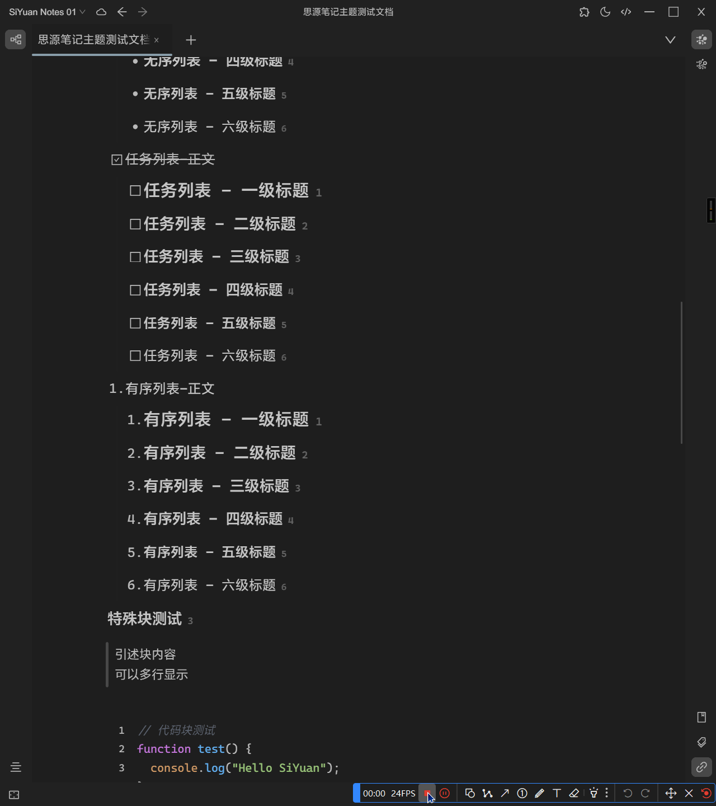

3.7 [打开思源后默认折叠文档树](https://ld246.com/article/1728469520911)

3.8 [文档树 shift+click 多选文档](https://ld246.com/article/1733364742803)

3.9 [彻底解决引用失效的问题](https://ld246.com/article/1752202438621)

必装的功能，可以放心剪切移动被引用过的块，不用再担心失效的问题。

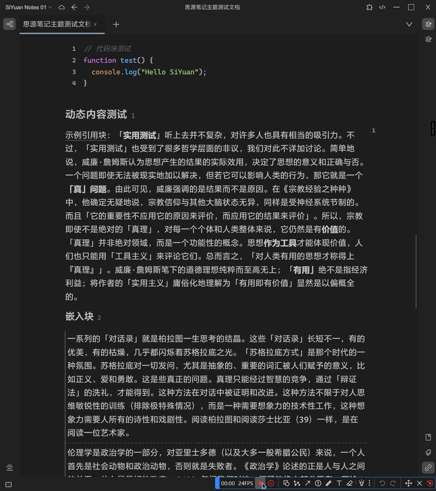

## 4 生成链接的工具

4.1 生成电脑文件链接：[思源笔记+everything链接本地文件](https://getquicker.net/Sharedaction?code=65079b38-7273-4b05-b498-08d9e9132325)

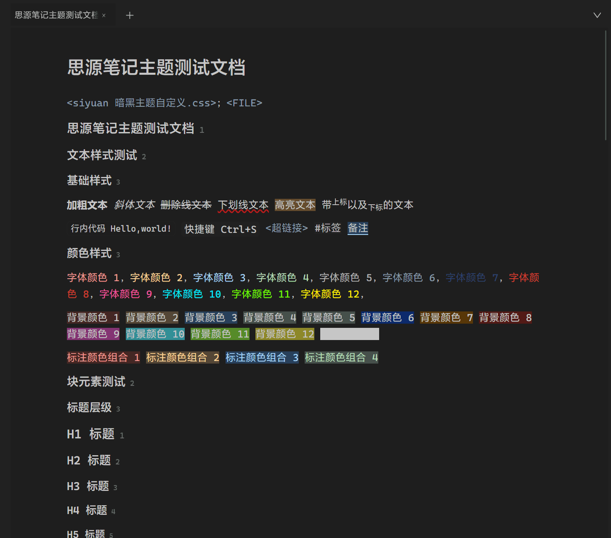

4.2 生成视频精准空降链接： [一键添加视频时间节点到笔记软件中：markdown2potplayer](https://github.com/livelycode36/markdown2potplayer)

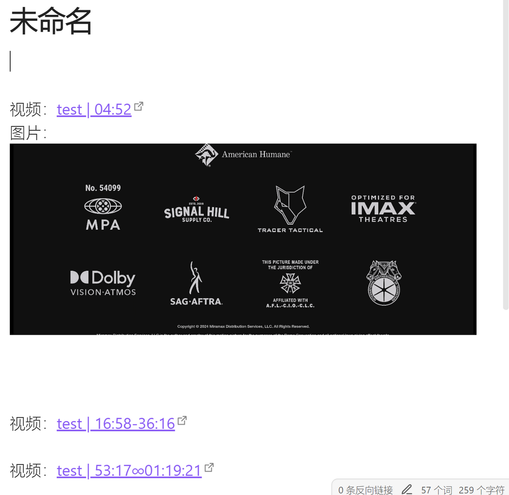

4.3 生成PDF标注链接：[和思源实现双向链接的pdf阅读器：BOOKXNOTE](http://www.bookxnote.com)

目前发现的唯一能和思源实现双向链接的pdf阅读器，即可在思源笔记中插入bookxnote中pdf的标记链接，也可在bookxnote中插入思源笔记的链接（会员功能）。

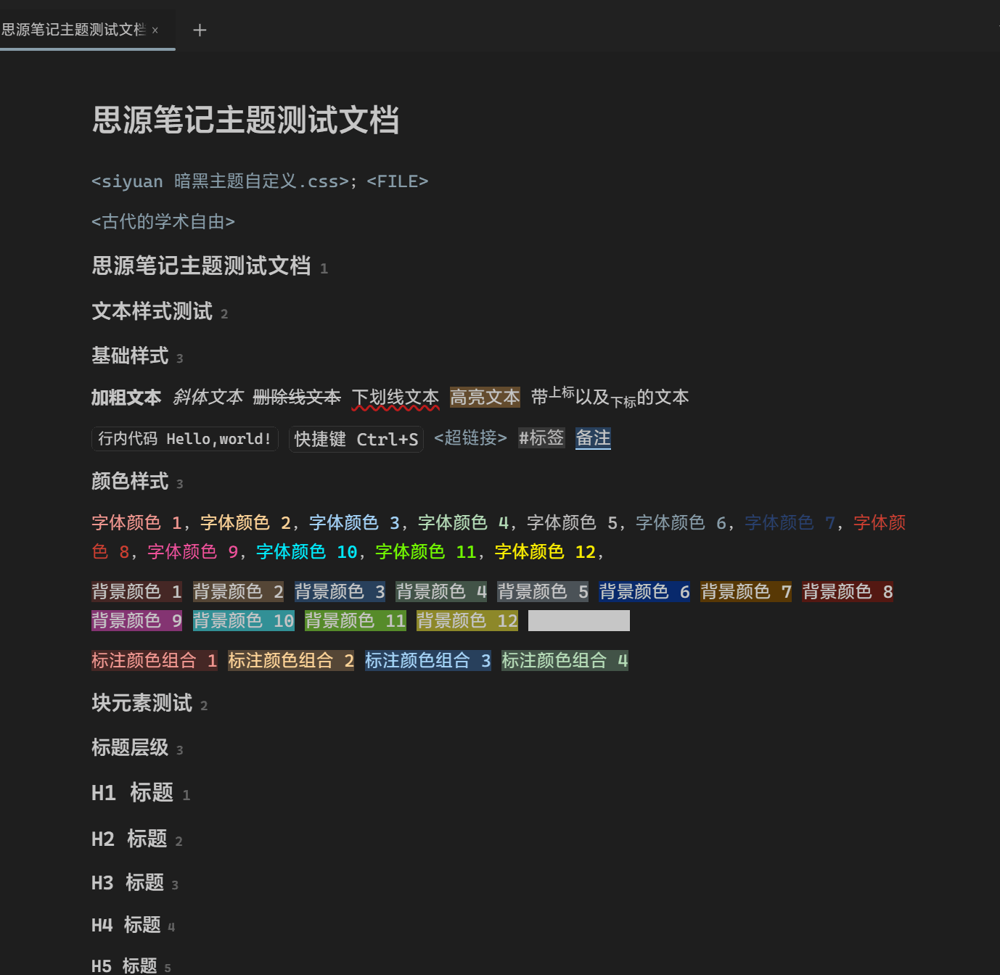
