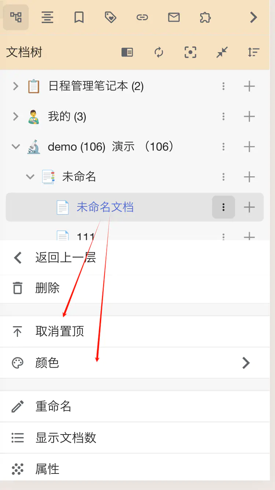
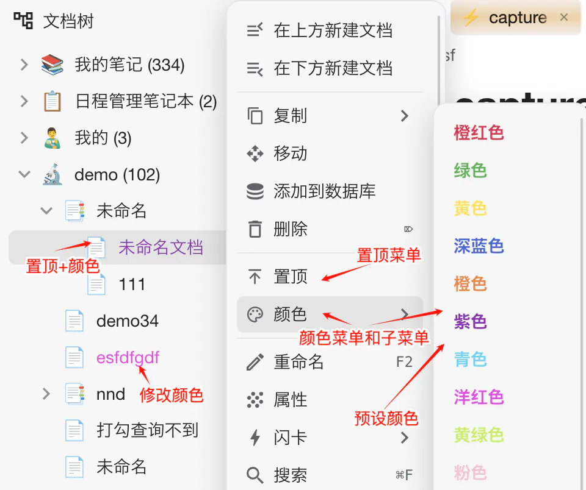

# [js] 文档树文档置顶和设置颜色 [0.0.8 完美版]

---

- [js] 文档树文档置顶和设置颜色 [0.0.8 完美版] - 链滴
- [https://ld246.com/article/1741359650489](https://ld246.com/article/1741359650489)
- 功能 文档树中，选择文档或文件夹，右键置顶，即在父级文件夹中置顶选中的文档或文件夹。 文档树中，选择文档或文件夹，右键选择颜色，即为选中的文档或文件夹添加指定的颜色。 文档树中，右键菜单出现时，按住 shift（手机版长按置顶按钮），可以置顶到顶层（支持文档和文件夹）。 兼容 pc 版和手机版 注意：暂不支持笔记本的置
- 2025-07-23 20:05

---

#### 功能

1. 文档树中，选择文档或文件夹，右键置顶，即在父级文件夹中置顶选中的文档或文件夹。
2. 文档树中，选择文档或文件夹，右键选择颜色，即为选中的文档或文件夹添加指定的颜色。
3. 文档树中，右键菜单出现时，按住shift（手机版长按置顶按钮），可以置顶到顶层（支持文档和文件夹）。
4. 兼容pc版和手机版

注意：暂不支持笔记本的置顶和设置颜色。

最新版0.0.8

1. 增加记住顶层置顶文件夹展开状态；
2. 修复文件夹置顶到顶层后定位不到问题；
3. 增加置顶/取消置顶时自动定位到目标文档；
4. 修复文档全部折叠后顶层置顶恢复后需要刷新才能显示的问题；
5. 修复已取消的顶层置顶无法实时同步问题；
6. 优化交互体验细节

#### 效果

动画演示  
​

pc版  
​

手机版  
​

#### 使用说明

##### 参数说明

// 是否开启置顶功能，true开启，false不开启  
const isEnableTopmost = true;

// 是否开启颜色功能，true开启，false不开启  
const isEnableColor = true;

// 是否开启顶层置顶功能，true开启，false不开启  
const isEnableTopmostLevel1 = true;

// 预设颜色列表，格式 {"主题":{"明暗风格":{"编码":{style:"颜色值", "description":"颜色描述"}}}}，编码值必须唯一，编码修改则原来设置的颜色将失效  
// "---1": {}, 代表分割线，后面的序号必须递增  
// （切换主题或亮色暗色风格时自动会切换配色方案）  
// 为了让目录树的颜色更突出，默认加了加粗显示（font-weight:bold样式），如果你不需要去掉这个样式即可

```js
let colors = {
    "default": {
        "light": {
            "now": { "style": "color:#1D4ED8;font-weight:bold;", "description": "NOW" },
            ...
        },
        "dark": {
            "now": { "style": "color:#42A5F5;font-weight:bold;", "description": "NOW" },
            ...
        }
    }
};
```

第一次运行后，会把该默认配置保存到 /data/storage/tree_colors_user_config.json 中，以后配置颜色只需要修改该文件即可，这样不受代码片段升级的影响。

也可以把 tree_colors_user_config.json 发出来与大家分享您的创意。

该配色灵感来自 @Floria233 大佬提供的配色方案，感谢 @Floria233 大佬!

see https://ld246.com/article/1741359650489/comment/1741430150736?r=wilsons#comments

##### 存储文件及使用说明

1. 修改/data/storage/tree_colors_user_config.json文件即可修改默认配色方案（第一次运行后生成）
2. 取消全部置顶只需删除/data/storage/tree_topmost.json文件即可（第一次置顶时生成）
3. 取消全部颜色只需删除/data/storage/tree_colors.json文件即可（第一次设置颜色时生成）
4. 取消全部顶层置顶只需删除/data/storage/tree_topmost_level1.json文件即可（第一次设置顶层置顶时生成）

##### 更新说明

0.0.4版本及以前的用户升级，需要先备份好代码里的colors参数配置再升级。

0.0.5及以后的用户升级，只需要备份好/data/storage/tree_colors_user_config.json文件即可。

#### 缘起

看到论坛小伙伴们和我都有置顶的需求，就实现了这个功能，顺便也把我想要的颜色配置也实现了。

起初本想用插件来着，后来鉴于能用就不折腾的思想，一切从简了。

#### 分享您的配色方案

也可以把您的tree_colors_user_config.json配色方案贴出来与大家分享。

默认配色方案如下（切换主题或亮色暗色风格时自动会切换颜色方案）

亮色主题  
​


暗色主题  
​


***多个风格主题，可在不同文件夹中使用不同风格样式。***

#### 旧版本（0.0.4版）

与 0.0.5+ 的区别是不支持根据主题及明暗风格配置颜色方案。

<details>

##### 代码

https://gitee.com/wish163/mysoft/blob/db03ef3d4206b5235ee7b85d2dd273f717b315d1/%E6%80%9D%E6%BA%90/%E7%BB%99%E6%96%87%E6%A1%A3%E6%A0%91%E6%96%87%E6%A1%A3%E6%B7%BB%E5%8A%A0%E9%A2%9C%E8%89%B2%E5%92%8C%E7%BD%AE%E9%A1%B6.js

##### 效果

pc版



手机版


##### 参数说明

```js
// 是否开启置顶功能，true开启，false不开启
const isEnableTopmost = true;

// 是否开启颜色功能，true开启，false不开启
const isEnableColor = true;
  
  
// 预设颜色列表，格式 {"编码":{style:"颜色值", "description":"颜色描述"}}，编码值必须唯一
// 也可以把该配置贴出来与大家分享您的创意
//默认颜色组采用20种人类最易识别的颜色 see https://zhuanlan.zhihu.com/p/508870810
const colors = {
   "orangeRed": { style: "color:#e6194B", description: "橙红色" },
   "green": { style: "color:#3cb44b", description: "绿色" },
   "yellow": { style: "color:#ffe119", description: "黄色" },
   ...
}
```

</details>

#### 鸣谢

再次感谢 @Floria233 大佬的配色灵感及提供这么多好的配色方案！

#### 打赏作者


#### 代码

👇 打赏后可见（为什么要打赏后可见？主要想通过这种方式统计使用人数及用户需求，以帮助作者分析哪些功能是用户最需要的）
