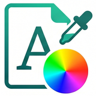

# 思源笔记样式效果测试预览

## 文本样式测试

### 基础样式

- **加粗文本**、*斜体文本*、~~删除线文本~~、<u>下划线文本</u>、==高亮文本==、带<sup>上标</sup>以及<sub>下标</sub>的文本
- 行内代码 `Hello,world!`​、快捷键 <kbd>Ctrl + s</kbd>​、<[超链接](https://ld246.com/tag/siyuan)>、#标签#​、备注

### 颜色样式

- 默认字体颜色 1，<span data-type="text" style="color: var(--b3-font-color1);">字体颜色 2</span>，<span data-type="text" style="color: var(--b3-font-color2);">字体颜色 3</span>，<span data-type="text" style="color: var(--b3-font-color3);">字体颜色 4</span>，<span data-type="text" style="color: var(--b3-font-color4);">字体颜色 5</span>，<span data-type="text" style="color: var(--b3-font-color5);">字体颜色 6</span>，<span data-type="text" style="color: var(--b3-font-color6);">字体颜色 7</span>，  
  <span data-type="text" style="color: var(--b3-font-color7);">字体颜色 8</span>，<span data-type="text" style="color: var(--b3-font-color8);">字体颜色 9</span>，<span data-type="text" style="color: var(--b3-font-color9);">字体颜色 10</span>，<span data-type="text" style="color: var(--b3-font-color10);">字体颜色 11</span>，<span data-type="text" style="color: var(--b3-font-color11);">字体颜色 12</span>，<span data-type="text" style="color: var(--b3-font-color12);">字体颜色 13</span>，<span data-type="text" style="color: var(--b3-font-color13);">字体颜色 14</span>
- 默认背景颜色 1 <span data-type="text" style="background-color: var(--b3-font-background1);">背景颜色 2</span> <span data-type="text" style="background-color: var(--b3-font-background2);">背景颜色 3</span> <span data-type="text" style="background-color: var(--b3-font-background4);">背景颜色 4</span> <span data-type="text" style="background-color: var(--b3-font-background5);">背景颜色 5</span> <span data-type="text" style="background-color: var(--b3-font-background6);">背景颜色 6</span> <span data-type="text" style="background-color: var(--b3-font-background7);">背景颜色 7</span>  
  <span data-type="text" style="background-color: var(--b3-font-background8);">背景颜色 8</span> <span data-type="text" style="background-color: var(--b3-font-background9);">背景颜色 9</span> <span data-type="text" style="background-color: var(--b3-font-background10);">背景颜色 10</span> <span data-type="text" style="background-color: var(--b3-font-background11);">背景颜色 11</span> <span data-type="text" style="background-color: var(--b3-font-background12);">背景颜色 12</span> <span data-type="text" style="background-color: var(--b3-font-background13);">背景颜色 13</span> <span data-type="text" style="background-color: var(--b3-font-background3);">背景颜色 14</span>
- <span data-type="text" style="color: var(--b3-font-color3); background-color: var(--b3-font-background8);">字体+背景组合 1</span> <span data-type="text" style="color: var(--b3-font-color4); background-color: var(--b3-font-background9);">字体+背景组合 2</span> <span data-type="text" style="color: var(--b3-font-color7); background-color: var(--b3-font-background5);">字体+背景组合 3</span> <span data-type="text" style="color: var(--b3-font-color11); background-color: var(--b3-font-background7);">字体+背景组合 4</span>

## 块元素测试

### 标题层级

> # H1 标题
>
> ## H2 标题
>
> ### H3 标题
>
> #### H4 标题
>
> ##### H5 标题
>
> ###### H6 标题

### 列表测试

1. 无序列表 (Unordered List)

- 这是一个无序列表项
- 这是另一个无序列表项

  - 这是一个二级无序列表项
  - 这是另一个二级无序列表项
- 回到一级无序列表项

2. 任务列表 (Task List)

- [ ] 待办任务 A（未完成）
- [X] 已完成任务 B（已打勾）
- [ ] 待办任务 C

  - [ ] 子任务 C-1（未完成）
  - [X] 子任务 C-2（已完成）

3. 有序列表 (Ordered List)

1. 第一步：打开思源笔记
2. 第二步：选择您喜欢的主题样式

   1. 调整字体大小
   2. 调整行间距与外边距
3. 第三步：保存并应用样式

‍

### 特殊块测试

#### 表格测试

|ID|模块名称|文件数|测试数|说明|
| ----| ----------| --------| --------| ------------------------------------|
|1|terminal|18|12|PTY 后端、WebSocket 协议、会话管理|
|2|context|12|10|思源上下文集成、CWD 解析、回写|
|3|ui|10|14|Vue 组件、composables、主题|

‍

#### 引述块

> 引述块内容
>
> 可以多行显示

#### 代码块

```javascript
// 这是一个思源笔记插件的初始化示例代码
import { Plugin } from "siyuan";

export default class StyleEditorPlugin extends Plugin {
    async onload() {
        console.log("Style Editor Plugin loaded successfully!");
        this.registerCommand();
    }

    registerCommand() {
        this.addCommand({
            langKey: "showStyleEditor",
            hotkey: "⌥⌘S",
            callback: () => {
                this.showEditorDialog();
            }
        });
    }

    showEditorDialog() {
        // 打开样式编辑器弹窗逻辑
    }
}
```

#### 图片块



### 动态内容测试

#### 示例引用块：

<span id="20260628101650-9xfwe0r" style="display: none;"></span>刘子业即位时，前两代都是皇三子成功上位的巧合对社会心理已有所影响，刘子业亦不例外。刘子业被刺之前，还想着要除掉自己弟弟中排行第三的江州刺史、晋安王刘子勋，派人带着毒药去寻阳杀这位只有十岁的三弟。刘子勋身边的官员也都有点迷惑于这个皇三子神话，干脆起兵反叛。甚至在刘子业被刺、刘彧即位之后，刘子勋旗下文武仍不忘初心，矢志自立朝廷，于宋明帝泰始二年正月乙未（466年2月7日）在寻阳称帝，年号义嘉。

#### 示例嵌入块内容

《宋书·薛安都传》：“太宗以四方已平，欲示威于淮外，遣张永、沈攸之以重军迎之。”既已受降，又派重将率大军“迎之”，摆明了不是宽大处理。《宋书·蔡兴宗传》记蔡兴宗力谏明帝（当然没起作用），有这样的话：“安都遣使归顺，此诚不虚。今宜抚之以和，即安所莅，不过须单使及咫尺书耳。”正确的做法是宣布不计过往，各人原有职任不变，朝廷只需要一介之使、片纸诏书，形势自然会安稳。现在大军压境，他们必将疑惧生变。

#### 引用块

[刘子业即位时，前两代都是皇三子成功上位的巧合对社会心理已有所影响，刘子业亦不例外。刘子业被刺之前，还想着要除掉自己弟弟中排行第三的江州刺史、晋安王刘子勋，派人带着毒药去寻阳杀这位只有十岁的三弟...](#20260628101650-9xfwe0r)

#### 嵌入块：

> #### 示例嵌入块内容
>
> 《宋书·薛安都传》：“太宗以四方已平，欲示威于淮外，遣张永、沈攸之以重军迎之。”既已受降，又派重将率大军“迎之”，摆明了不是宽大处理。《宋书·蔡兴宗传》记蔡兴宗力谏明帝（当然没起作用），有这样的话：“安都遣使归顺，此诚不虚。今宜抚之以和，即安所莅，不过须单使及咫尺书耳。”正确的做法是宣布不计过往，各人原有职任不变，朝廷只需要一介之使、片纸诏书，形势自然会安稳。现在大军压境，他们必将疑惧生变。

### 数学公式测试

行内公式：$E = mc^2$  

块级公式：

$$
f(x) = \frac{1}{\sigma \sqrt{2\pi}} e^{-\frac{1}{2}\left(\frac{x-\mu}{\sigma}\right)^2}
$$

‍

### 其他

#### 分割线

---

#### 自定义 HTML 测试

<div>
<div class="custom-card">
  <h3>探索专属主题样式</h3>
  <p>输入您感兴趣的风格关键词，快速筛选并应用精美设计。</p>
  <div class="input-group">
    <input type="text" placeholder="输入风格（如：深色极简、马卡龙、赛博朋克）" class="custom-input" />
    <button class="custom-button">搜索样式</button>
  </div>
</div>
</div>

‍
